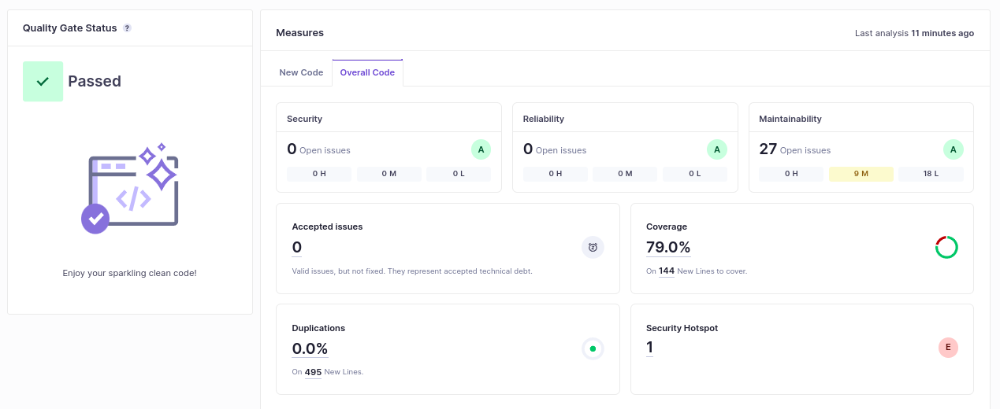

# Lab6_1
## alínea f)

O meu projeto obteve o nível **A** tanto na **Security**, como na **Reliability**, e na **Maintainability**, com 79% de *coverage*. Apresenta, no entanto, 27 *code smells* e 1h24 de *debt*. Os resultados estão apresentados na seguinte imagem:

|Issue| Problem description | How to solve |
|-----|---------------------|--------------|
| Security Hotspots | **Weak Criptography** caused by a pseudorandom number generator | Instead of using the *Random()* method, one more secure could be used like the *SecureRandom()*.|
| Code Smell (Medium) on *BoundedSetOfNaturalsTest.java*| Use of *assertTrue* e *assertFalse* to test the equality between two variables | Use *assertEquals* instead of *assertTrue* and *assertNotEquals* instead of *assertTrue*. |
| Code Smell (Minor) on *EuromillionsDraw.java*| Use of *ArrayList* as return type of a method | Use an interface, like *List* instead of *ArrayList*. |
| Code Smell (Minor) on *EuromillionsDraw.java*| Type specification (*Dip*) in a constructor | The type specification is not needed, can be replaced by *"<>"*. |
