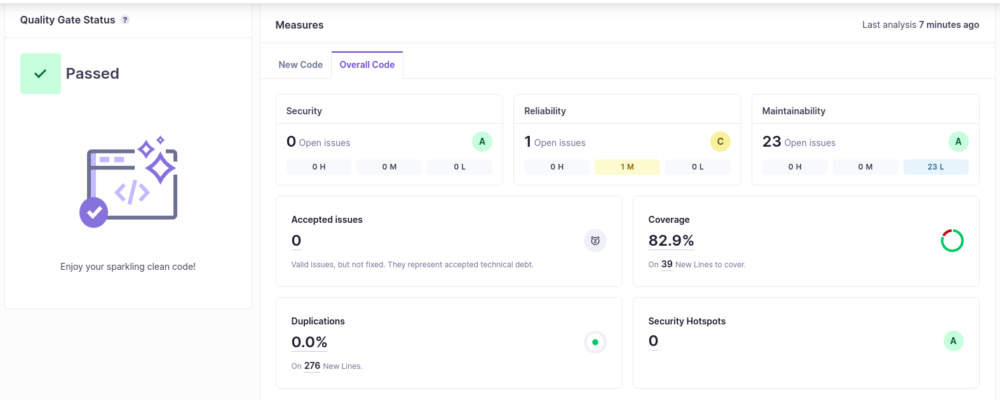
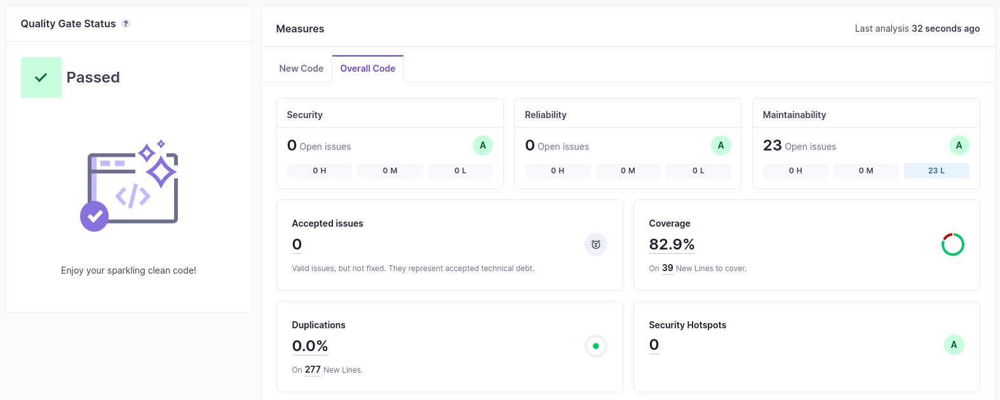
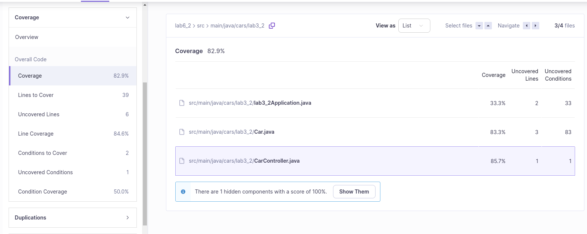

# Lab6_2

## alínea a)

A technical debt encontrada foi de 1h05min. A **technical debt** refere-se aos futuros custos de reprogramção ou manutenção necessárias de forma a priorizar velocidade, short cuts ou releases acima da qualidade do código ou até de um código completo. Neste caso, é como a dívida que uma empresa teria the pagar na forma de horas para favorecer a velocidade acima da qualidade.

O meu projeto obteve o nível **A** tanto na **Security**, como na **Maintainability**, mas obteve o nível **C** na **Reliability**, apresentando 82,9% de *coverage*. Os resultados estão apresentados na seguinte imagem:

## alínea b)

O problema de reliability é de impacto médio e está associado à falta da anotação *@PathVariable* no método *getCarById*. Esta anotação é necessária como parâmetro do método para capturar a path variable *id*, caso contrário, o Spring pode ignorar essa variável. Para resolver este problema, adicionei então a anotação *@PathVariable* ao método *getCarById*:

Quanto aos **code smells**, nenhum destes era de impacto crítico ou maior.

## alínea c)

O meu projeto apresenta 82,9% de *coverage* e faltam cobrir 39 linhas de código, sendo maioritariamente devido a métodos como *equals()*, *hashCode()* e *toString()*.

